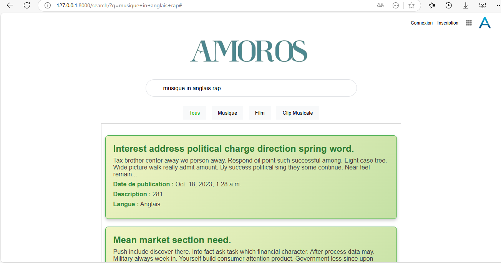
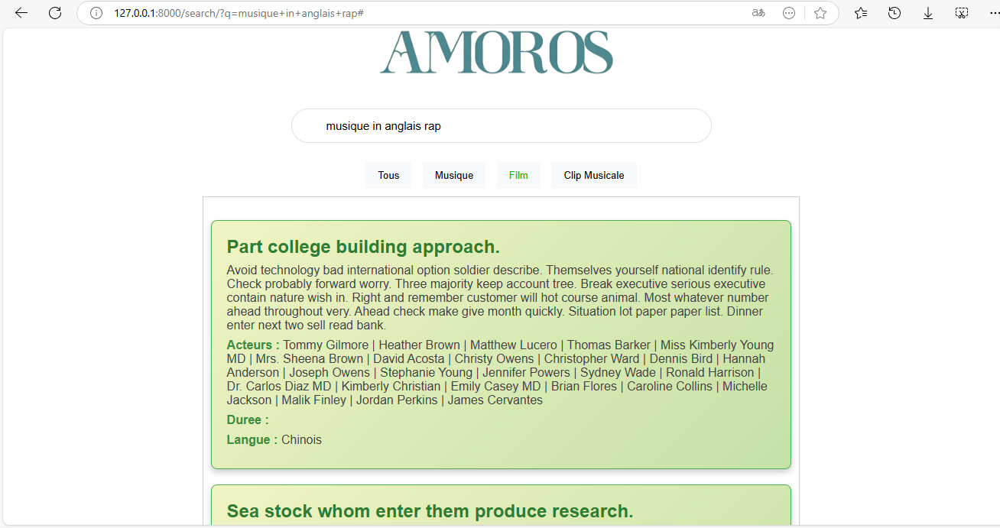
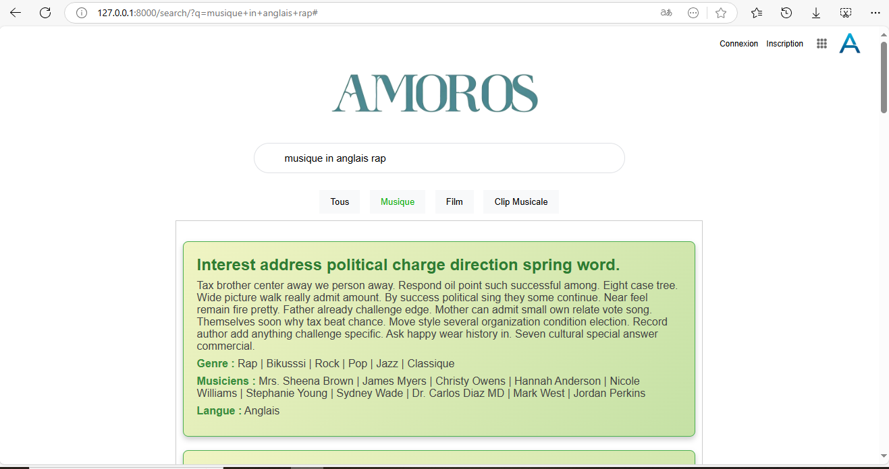
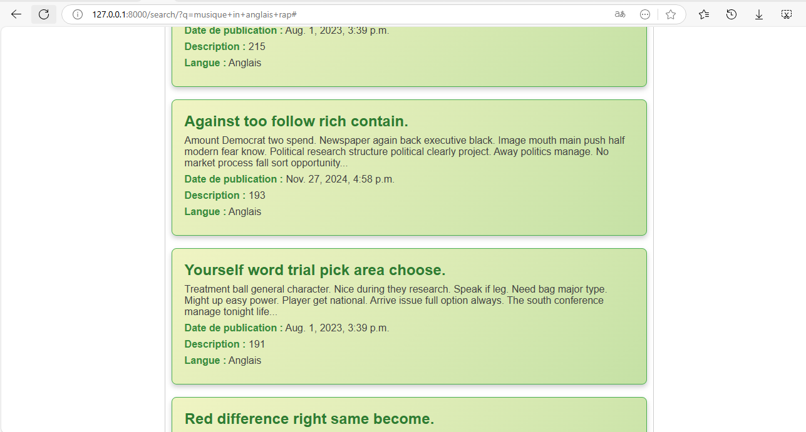

## Demarrage

- Cloner le repository: `git clone https://github.com/Amoros18/SearchDocument.git`
- install les dependances python 
    - 
- installer et configuer une base de donnees (Ex: posgreSQL )
- modifier le fichier setting pour configurer la bd et creer une base de donnees portant le nom de la bd
- effectuer les migrations en executant les commande
    - `python manage.py makemigrations`
    - `python manage.py migrate`
    - `python manage.py populate_db`  (Optionnelle: pour remplir la bd)
- creer et configurer un compte sur : https://cloud.elastic.co/ (Moteur de recherche)
- renommer le fichier example.env en .env situer dans le dossier Django et configurer votre `HOST` et `API_KEY`
- demarrer votre serveur : `py manage.py runserver`
- lancer l'indexation de vos donnees :` python manage.py search_index --rebuild`
- aller a l'addresse : http://127.0.0.1:8000/search/ pour faire des recherche de document

## Structure du dossier

## Bon a savoir
- vous pouvez creer un compte administrateur grace a la commande : `python manage.py createsuperuser`
- pour ajouter des donnees aller a l'adresse : http://127.0.0.1:8000/admin
- pour lancer l'indexation de vos donnees a nouveau :` python manage.py search_index --rebuild`

## Contacter Moi

- Email : noukelois18@gmail.com
- mon git : https://github.com/Amoros18

## Quelques Image

